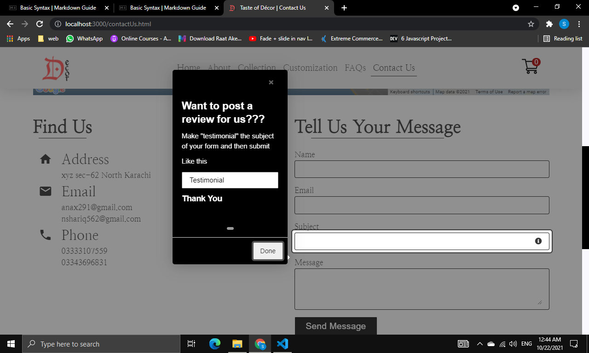

### To run this project

- Clone the repository or download the zip file and extract it
- Run `npm install` in the terminal to download all the dependencies
- Run `npm json:server` in the terminal. It will run the project on the localhost port 3000. Then you can view it by clicking here [http://localhost:3000](http://localhost:3000)

# Taste Of Decor

This is an e-commerce website built with html, css and vanilla javascript utilizing many of the modern syntaxes and latest features. This is a static website (no backend) and therefore it lacks many of the features like

- No sign in / sign up features
- No proper admin panel
- No protection for admin pages

However to get a taste of backend, this websites uses **JSON-SERVER**. It can provide us with a fake rest api to work with. It is great for mocking a backend and prototyping.

---

Please [click here](https://www.npmjs.com/package/json-server) to read more about json server.

---

With json-server we:

- Saved all information about our products in a json file from where json-server reads it and renders on our web page. It greatly helps us to scale our project. We can add the necessary details of as many products and categories in our json file and all the pages will be created automatically. **No Need To Create HTML Pages for each and every product**
- We managed categories, products, orders, and user messages all through json-server. All the details get saved into json format in that file and from there we can use it.

---

### Some JS Libraries Used In The Project

1. [GSAP](https://greensock.com/gsap/). A very popular javascript library that is used for our intro animation and some modal animations.
   

2. [INTROJS](https://introjs.com/). This is not so popular yet a very useful library. It is used to guide the users, how they can write testimonials for us.
   

3. [html2canvas](https://www.npmjs.com/package/html2canvas). It is used to take screenshot of our design in customization page

---

### APIs Used In Our Project

1. [Fetch API](https://developer.mozilla.org/en-US/docs/Web/API/Fetch_API/Using_Fetch). Web API which is used to fetch data from our localhost

2. [Intersection Observer API](https://developer.mozilla.org/en-US/docs/Web/API/Intersection_Observer_API). It is used to trigger animations of different elements as they get into viewport (or as the user scroll)

3. [Drag and Drop API](https://developer.mozilla.org/en-US/docs/Web/API/HTML_Drag_and_Drop_API). This API was used to create the page of customization.

4. [Shadow DOM API](https://developer.mozilla.org/en-US/docs/Web/Web_Components/Using_shadow_DOM) and [Custom Elements API](https://developer.mozilla.org/en-US/docs/Web/Web_Components/Using_custom_elements). They are used in conjunction with each other and help us create a custom element of footer that encapsulates all the markup, style and functionality in it. It was used to create footer component so we don't have to repeat code in every file which is redundant and also makes it difficult to make changes (imagine making same changes in multiple files)

   - Open any html file. You can find it at the bottom of markup   `<custom-footer></custom-footer>`

5. [Google Map API](https://developers.google.com/maps). It is used to implement google map in our contact page.

---

> In the end I would just like to say, It was a great experience working on this project. We came to learn so many new things, as mentioned above. We implemented many of the things for the first time in our project.
